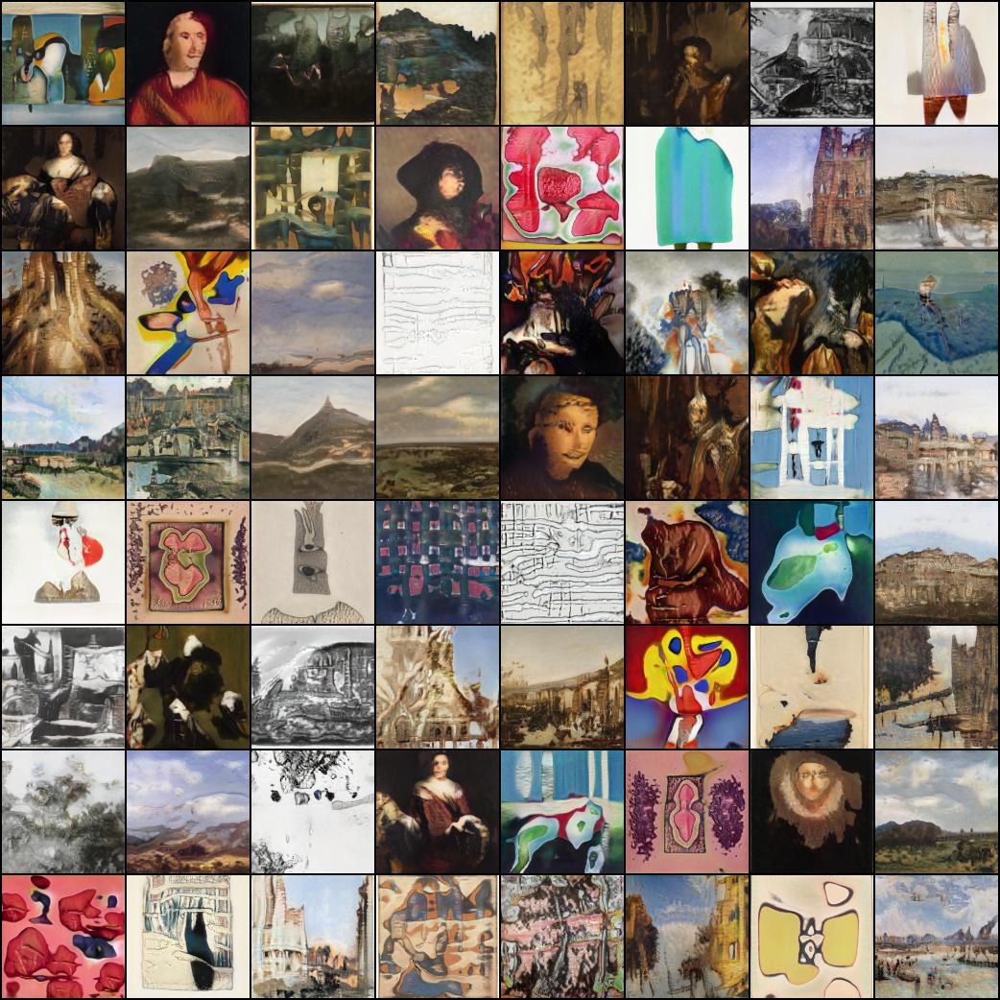

# Implementation of [StyleGAN2 paper](https://arxiv.org/abs/1912.04958) in [PyTorch](https://pytorch.org/)

## Progress so far:
Trained on subset of paintings scraped from [WikiArt](https://www.wikiart.org/) (image size of 128):

## TODO:
- [ ] path-length regularization
