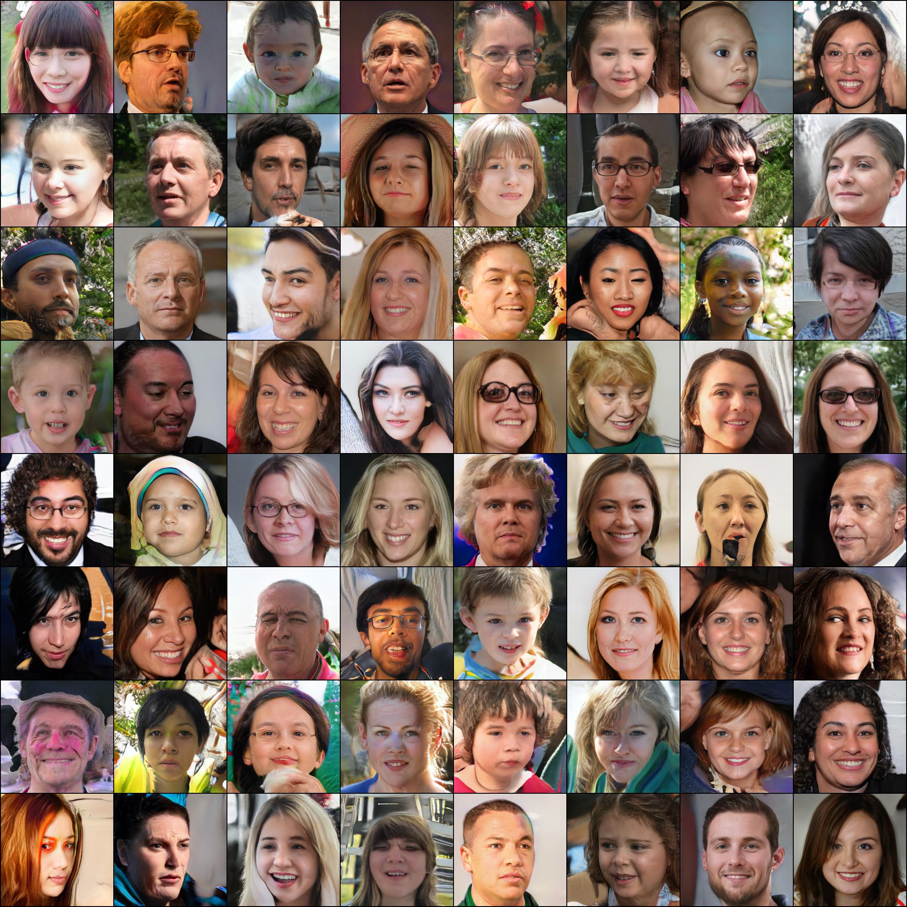

# Implementation of [StyleGAN2 paper](https://arxiv.org/abs/1912.04958) in [PyTorch](https://pytorch.org/)

## Note
All examples bellow are of **somewhat** trained models. I only have single `1080ti` and a lot of other projects to train so due to computational and time limits those are result I have so far. 

## FFHQ (256 size)

Style mixing

Noise distribution

Just random samples

## [WikiArt](https://www.wikiart.org/) (128 size)

Trained on subset of paintings scraped from [WikiArt](https://www.wikiart.org/)

